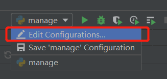
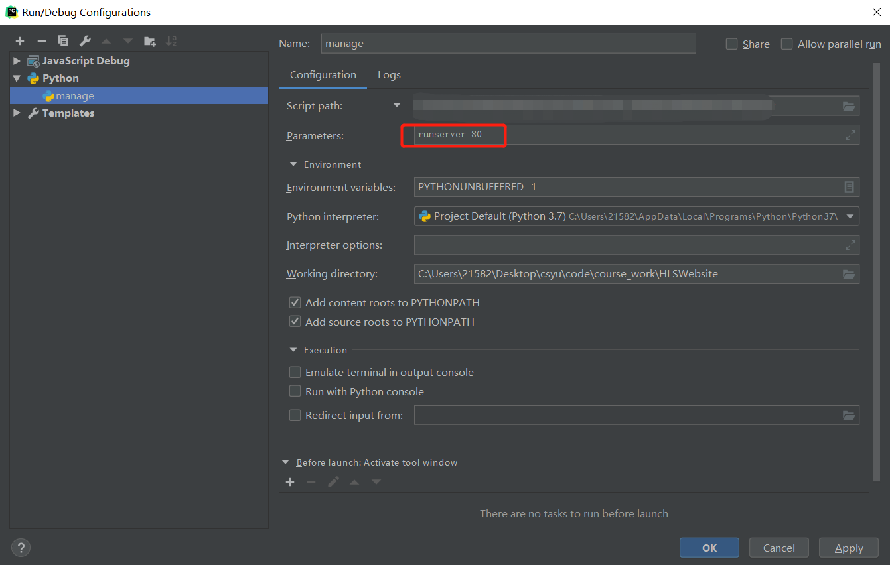

#  House Lease and Sale Website

> 一个基于Python3.7 + Django 3.0.8 制作的 “房屋租赁和出售的网站项目“

------

### IDE
- Pycharm

### DataBase
- MySQL：5.7版

### 依赖环境
- Django：3.0.8
- Python：3.7
- Pillow：7.1.2
- mysqlclient：1.4.6


------

### 项目部署（Windows系统）

1. 下载项目

    * 访问 https://github.com/csyu12/Lease-And-Sale 下载本项目源码解压

    * 通过配置PyCharm环境直接Git

2. 安装项目依赖

   ```
   pip install -r requirements.txt
   ```
   建议创建虚拟环境，在虚拟环境下安装本项目依赖，以免污染本地包

3. 创建MySQL数据库（根据实际使用的数据库进行配置，不必照本宣科）

    MySQL数据库中执行：

    ```mysql
    CREATE DATABASE `HRS` CHARSET UTF8;
    ```

    在`RS_system/setting.py` 修改数据库配置，如下所示：

    ```python
    DATABASES = {
        'default': {
            'ENGINE': 'django.db.backends.mysql',
            'HOST': 'localhost',
            'PORT': '3306',
            'NAME': 'HRS',
            'USER': 'root',
            'PASSWORD': '123456',
        }
    }
    ```

    在终端下执行:

    ```python
    python3 manage.py makemigrations
    python3 manage.py migrate
    ```

4. 创建后台管理员账户

    ```python
    python3 manage.py createsuperuser
    ```

    按要求输入用户名、邮箱（格式要合法）、密码

5. 运行服务器

   * 第一种方法：在终端中输入

   ```python
   python3 manage.py runserver
   ```

   在浏览器打开 `http://127.0.0.1:8000/` 即可访问项目主页

   * 第二种方法：可以运行manage.py文件，修改配置，如下图。后续只需要运行manage.py即可

     

     

6. 进入后台

   - 在浏览器输入127.0.0.1:8000/admin
   - 使用第5步创建的后台管理员账户进行登录
   - 建议使用后台添加测试数据，比较方便